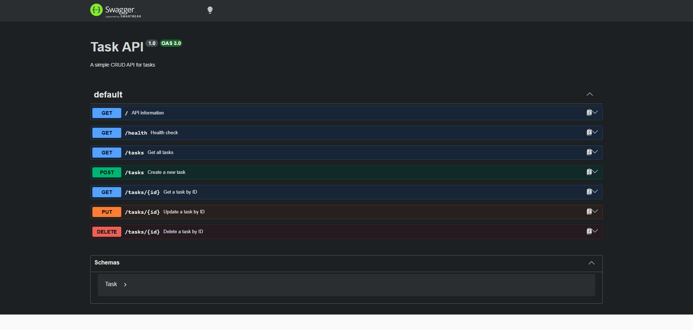
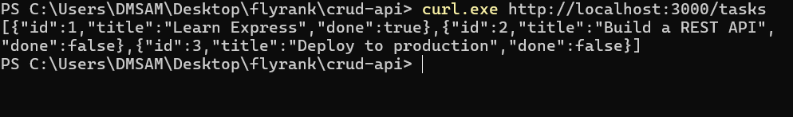

# Task API

A small CRUD API for managing tasks, built with Express. Includes an OpenAPI
specification and an interactive Swagger UI documentation page.

## Assignment Context

**W2 · A1 — CRUD API** for the
FlyRank AI Internship.

## What it is

`Task API` is a REST API that lets you create, read, update, and delete tasks.
Tasks are stored in memory (in a list in `src/index.js`) — no database needed.
Each task has an `id` (number), a `title` (string), and a `done` flag (boolean).

## Install & Run

Install the dependencies and start the server in one command:

```bash
pnpm install && pnpm start
```

The server starts on `http://localhost:3000` (override the port with the `PORT`
environment variable, e.g. `PORT=8080 pnpm start`).

## Endpoints

| Method | Path | Description | Status |
|--------|------|-------------|--------|
| `GET` | `/` | API information | `200` |
| `GET` | `/health` | Health check | `200` |
| `GET` | `/tasks` | List all tasks | `200` |
| `GET` | `/tasks/:id` | Get a single task by id | `200` / `404` |
| `POST` | `/tasks` | Create a task (`{"title": "..."}`) | `201` / `400` |
| `PUT` | `/tasks/:id` | Update a task's `title` and/or `done` | `200` / `400` / `404` |
| `DELETE` | `/tasks/:id` | Delete a task | `204` / `404` |

### Example request — create a task

```bash
curl -i -X POST http://localhost:3000/tasks \
  -H "Content-Type: application/json" \
  -d '{"title": "Buy milk"}'
```

```http
HTTP/1.1 201 Created
X-Powered-By: Express
Content-Type: application/json; charset=utf-8
Content-Length: 41
ETag: W/"29-7DYI38RGcDCdv/nsasAbNId57jc"
Date: Mon, 07 Sep 2026 20:54:34 GMT
Connection: keep-alive

{"id":4,"title":"Test task","done":false}
```

## Swagger UI

Interactive documentation is served at `/docs`. Open
`http://localhost:3000/docs` in your browser — every endpoint is listed with a
**Try it out** button that sends real requests.

The OpenAPI 3.0 specification is defined inline in `src/index.js`
(`openapiSpec` constant) and served to Swagger UI via `swagger-ui-express`.

## Screenshots

### Swagger UI



### cURL CRUD output



## Notes

- `id` values are assigned sequentially from the highest existing id, so they
  never collide after a task is deleted.
- `POST /tasks` requires a non-empty `title` string; missing/empty titles
  return `400`.
- `PUT /tasks/:id` is a partial update — send only the fields you want to
  change (`title` and/or `done`).
- Unknown ids return `404` with `{"error": "Task <id> not found"}`.